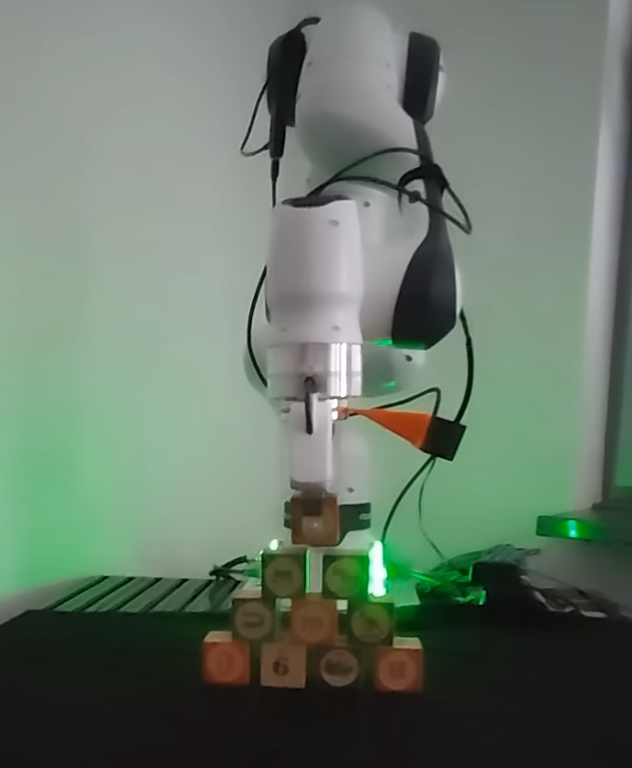
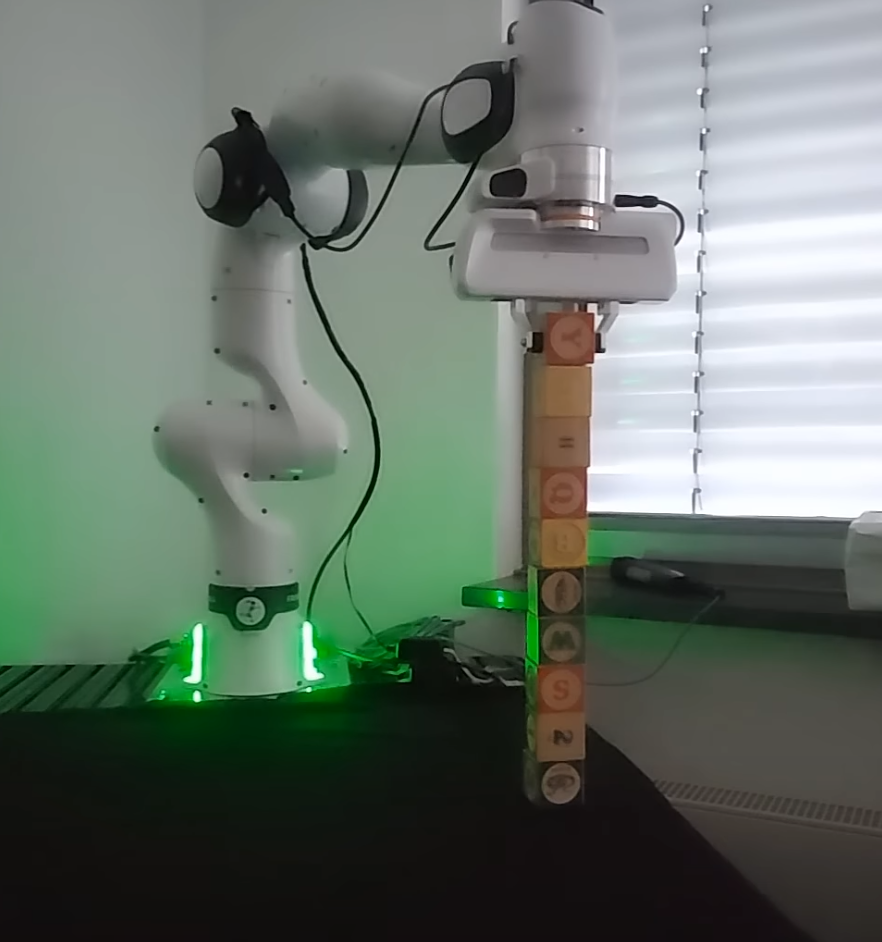

# IRobMan Project 1 - Team 5 (24/25ws) TUDa

## Overview

This project develops a pipeline to identify cubes and implement a pick-and-place system. The pipeline consists of two main parts: **Perception** and **Motion**. The Perception part identifies and processes the cubes from point clouds, while the Motion part handles the robotic arm's movement to perform the pick-and-place tasks.
<p align="center">
  
</p>
<p align="center">
  
</p>

[](https://www.youtube.com/watch?v=1B54wzQt1AM)


## Project Structure

The repository is divided into the following sections:

- **Perception**:
  - Point Cloud Acquisition and Fusion
  - Point Cloud Alignment
  - Grasp Generation
  - Color Detection

- **Motion**:
  - Motion Planning and Execution
  - Safety Mechanism
  - Pick and Place
  - Engineering Trick

## Key Features

1. **Point Cloud Acquisition and Fusion**: 
   - Acquire point cloud data relative to the world coordinate system and select Regions of Interest (ROI).
   - Fuse point clouds from multiple perspectives and time frames for enhanced data quality.

2. **Point Cloud Alignment**:
   - Use RANSAC for coarse alignment followed by ICP (Iterative Closest Point) for fine alignment.
   - Correct transformation matrices to ensure the Z-axis points upward.

3. **Grasp Generation**:
   - Generate grasping poses using ICP results and filter out possible collision risks through collision detection and Octrees.

4. **Color Detection**:
   - Implement HSV-based color detection to identify colored cubes (blue, green, red, yellow) for color-specific tasks.

5. **Motion Planning**:
   - Control the robotic arm using MoveIt to move it to specified positions.
   - Ensure motion safety with added wall and table simulations to prevent collisions.

6. **Pick and Place**:
   - Gripper control to pick and place cubes using Cartesian paths.
   - Handle multiple cubes using an engineering trick to constrain cube movement using two perpendicular grippers.

## Dependencies

- ROS (Robot Operating System)
- MoveIt
- Python
- OpenCV (for color detection)
- YOLO (for object detection)
- ICP and RANSAC algorithms

## Setup

To run this project, follow these setup steps:

1. **Clone the Repository**:
   ```bash
   git clone https://github.com/lvxiangyu11/IRobMan1_Project_Team5_24ws
   ```

2. **Install Dependencies**
   Please read `READEME_original.md`.

3. **Swap Cubes** 
    ``` bash 
    python scripts/spawn_cubes.py
    ```
4. **Change Setting for Simulator**
   If you run on real robot, skip this step. If you run on gazebo please `scripts/mycode_clean/1_getPointCloud/save_point_cloud.py` in line 101 unlable, and make line 102 labeled, to make sure that point cloud be trasposed correctly. 

5. **Run whole pipeline**
   You will find wohle pipeline in `scripts/mycode_clean/2_perception//Perception.ipynb`
   Yolo's part still be seperated from main pipeline, you can call it on `yolo`
   For CNN's approach please see `main` branch.

## **Special Statement**
Our project use Franka panda robot, moveit, ROS 1 neotic, cubes are "ABC Holzbausteine mit Stofftasche 28 große ABC Bauklötze Bausteine Buchstaben Zahlen Tierbilder" from wiladu.

## **Contributions**
Read written report.

## **Acknowledgements**
Read written report.
